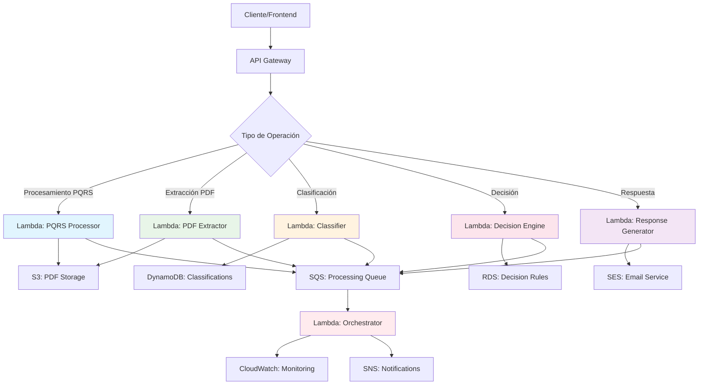

**# Guía de Integración con AWS Lambda**

**## ¿Qué es AWS Lambda?**

AWS Lambda es un servicio de computación serverless que permite ejecutar código sin aprovisionar o administrar servidores. Paga solo por el tiempo de cómputo que consume y escala automáticamente según la demanda.

**### Características principales:**

- ***Serverless****: No necesitas gestionar servidores
- ***Escalabilidad automática****: Se ajusta automáticamente a la carga
- ***Pago por uso****: Solo pagas por las ejecuciones
- ***Integración nativa****: Se conecta fácilmente con otros servicios AWS
- ***Múltiples lenguajes****: Soporta Python, Node.js, Java, C#, etc.

**## Diagrama de Flujo - Arquitectura Propuesta**



**## Arquitectura Recomendada**

**### Opción 1: Microservicios Lambda (RECOMENDADA)**

- ***Ventajas:****
- ✅ Escalabilidad independiente por componente
- ✅ Menor tiempo de arranque (cold start)
- ✅ Mejor aislamiento de errores
- ✅ Desarrollo y despliegue independiente
- ✅ Optimización de costos por función
- ***Estructura:****

```

├── lambda-pdf-extractor/

│   ├── handler.py

│   ├── requirements.txt

│   └── serverless.yml

├── lambda-classifier/

│   ├── handler.py

│   ├── requirements.txt

│   └── serverless.yml

├── lambda-decision-engine/

│   ├── handler.py

│   ├── requirements.txt

│   └── serverless.yml

├── lambda-orchestrator/

│   ├── handler.py

│   ├── requirements.txt

│   └── serverless.yml

└── shared-layers/

├── common-utils/

└── ml-models/

```

**### Opción 2: Lambda Monolítica**

- ***Ventajas:****
- ✅ Menor complejidad de despliegue
- ✅ Menos funciones Lambda que gestionar
- ***Desventajas:****
- ❌ Mayor tiempo de arranque
- ❌ Escalabilidad menos granular
- ❌ Mayor tamaño del paquete

**## Flujo de Procesamiento Detallado**

**### 1. Recepción de PQRS**

```

Cliente → API Gateway → Lambda Orchestrator

↓

Validación inicial

↓

S3 (almacenar PDF)

↓

SQS (cola de procesamiento)

```

**### 2. Procesamiento Asíncrono**

```

SQS → Lambda PDF Extractor → DynamoDB (metadatos)

→ Lambda Classifier → DynamoDB (clasificación)

→ Lambda Decision Engine → RDS (decisiones)

→ Lambda Response Generator → SES (email)

```

**### 3. Monitoreo y Notificaciones**

```

Todas las Lambdas → CloudWatch Logs

→ CloudWatch Metrics

→ SNS (alertas)

```

**## Servicios AWS Complementarios**

**### Almacenamiento**

- ***S3****: PDFs originales y procesados
- ***DynamoDB****: Metadatos, clasificaciones, cache
- ***RDS****: Reglas de decisión, auditoría

**### Comunicación**

- ***SQS****: Colas de procesamiento asíncrono
- ***SNS****: Notificaciones y alertas
- ***API Gateway****: Punto de entrada REST/GraphQL

**### Monitoreo**

- ***CloudWatch****: Logs, métricas, alarmas
- ***X-Ray****: Trazabilidad distribuida
- ***CloudTrail****: Auditoría de API calls

**### Seguridad**

- ***IAM****: Roles y políticas
- ***Secrets Manager****: Credenciales y API keys
- ***KMS****: Encriptación de datos

**## Adaptaciones Necesarias del Código Actual**

**### 1. Separación de Agentes**

```python

# Antes (monolítico)

class GeneralOrchestratorAgent:

def __init__(self, agents):

self.agents = agents

def run(self, input_data):

# Ejecuta todos los agentes secuencialmente

pass

# Después (microservicios)

def lambda_extractor_handler(event, context):

extractor = ExtractorAgent()

return extractor.run(event['input_data'])

def lambda_classifier_handler(event, context):

classifier = ClassifierAgent()

return classifier.run(event['input_data'])

```

**### 2. Gestión de Estado**

```python

# Usar DynamoDB para estado compartido

import boto3

def save_processing_state(session_id, agent_name, result):

dynamodb = boto3.resource('dynamodb')

table = dynamodb.Table('pqrs-processing-state')

table.put_item(

Item={

'session_id': session_id,

'agent_name': agent_name,

'result': result,

'timestamp': datetime.now().isoformat()

}

)

```

**### 3. Comunicación Asíncrona**

```python

# Enviar mensajes entre Lambdas

import boto3

def send_to_next_stage(queue_url, message):

sqs = boto3.client('sqs')

sqs.send_message(

QueueUrl=queue_url,

MessageBody=json.dumps(message)

)

```

**## Consideraciones de Rendimiento**

**### Límites de Lambda**

- ***Tiempo máximo****: 15 minutos
- ***Memoria****: 128 MB - 10,008 MB
- ***Tamaño del paquete****: 50 MB (zipped), 250 MB (unzipped)
- ***Variables de entorno****: 4 KB

**### Optimizaciones**

1. ****Layers****: Compartir dependencias comunes

2. ****Provisioned Concurrency****: Reducir cold starts

3. ****Connection pooling****: Reutilizar conexiones DB

4. ****Caching****: Redis/ElastiCache para datos frecuentes

**## Estimación de Costos**

**### Ejemplo mensual (1000 PQRS):**

- ***Lambda****: ~$5-15 USD
- ***API Gateway****: ~$3-5 USD
- ***DynamoDB****: ~$2-8 USD
- ***S3****: ~$1-3 USD
- ***SQS/SNS****: ~$1-2 USD
- ***Total estimado****: $12-33 USD/mes

**## Ventajas de la Integración Lambda**

**### Técnicas**

- ✅ ***Escalabilidad automática****: Maneja picos de carga
- ✅ ***Alta disponibilidad****: 99.95% SLA
- ✅ ***Tolerancia a fallos****: Reintentos automáticos
- ✅ ***Monitoreo integrado****: CloudWatch nativo

**### Operacionales**

- ✅ ***Sin gestión de servidores****: AWS maneja la infraestructura
- ✅ ***Actualizaciones automáticas****: SO y runtime actualizados
- ✅ ***Backup automático****: Código versionado
- ✅ ***Seguridad****: Aislamiento por defecto

**### Económicas**

- ✅ ***Pago por uso****: Solo pagas por ejecuciones
- ✅ ***Sin costos fijos****: No hay servidores idle
- ✅ ***Escalabilidad de costos****: Crece con el uso

**## Desventajas y Consideraciones**

**### Limitaciones**

- ❌ ***Cold starts****: Latencia inicial
- ❌ ***Vendor lock-in****: Dependencia de AWS
- ❌ ***Debugging complejo****: Entorno distribuido
- ❌ ***Límites de tiempo****: 15 minutos máximo

**### Mitigaciones**

- ***Cold starts****: Provisioned Concurrency, optimización de código
- ***Vendor lock-in****: Usar frameworks como Serverless Framework
- ***Debugging****: X-Ray, logs estructurados
- ***Límites de tiempo****: Dividir procesos largos

**## Próximos Pasos Recomendados**

1. ****Fase 1****: Migrar ExtractorAgent a Lambda

2. ****Fase 2****: Migrar ClassifierAgent y DecisionAgent

3. ****Fase 3****: Implementar orquestación con Step Functions

4. ****Fase 4****: Optimizar rendimiento y costos

5. ****Fase 5****: Implementar CI/CD con AWS CodePipeline

**## Conclusión**

La integración con AWS Lambda es altamente recomendada para este sistema PQRS debido a:

- ***Naturaleza del procesamiento****: Cargas de trabajo esporádicas e impredecibles
- ***Escalabilidad requerida****: Necesidad de manejar picos de demanda
- ***Complejidad del sistema****: Beneficio de la arquitectura de microservicios
- ***Costos operacionales****: Reducción significativa vs. servidores tradicionales

La arquitectura de microservicios Lambda proporcionará la flexibilidad, escalabilidad y eficiencia de costos necesarias para un sistema de procesamiento de PQRS moderno y robusto.
